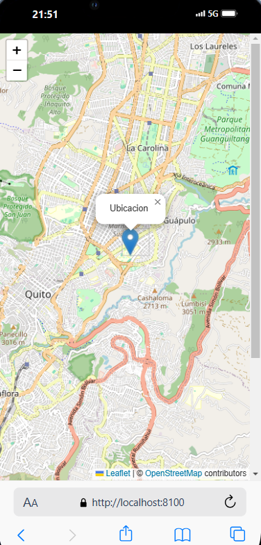

# Mostrar ubicación en Google maps o en OpenStreetMap.

_Descripcion_

**Aplicacion realizada con ionic para determinar la vista de una ubicacion por medio de OpenStreetMap**

<p align="center">
 

</p>

## Comandos para correr el proyecto

- Instalar dependencias

```
npm install
```

- Correr el proyecto

```
ionic serve
```
